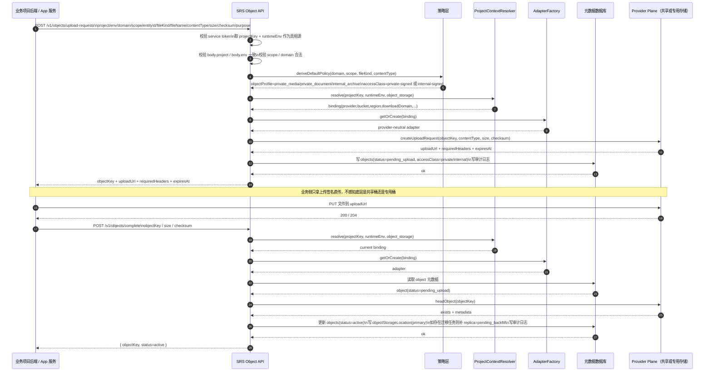
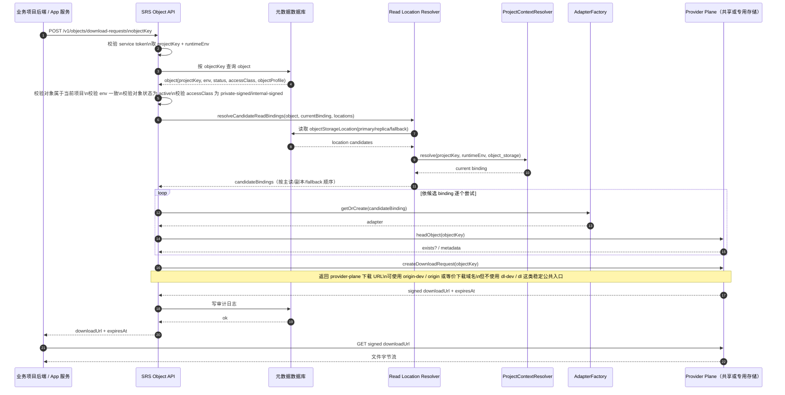
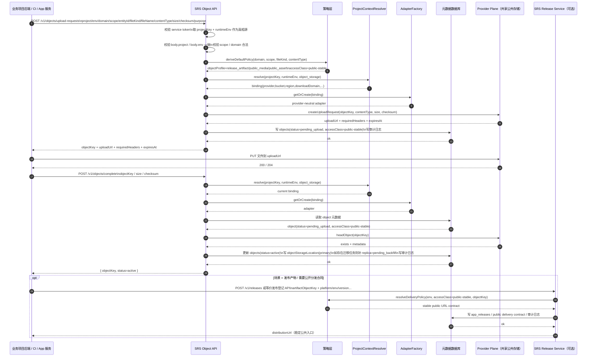
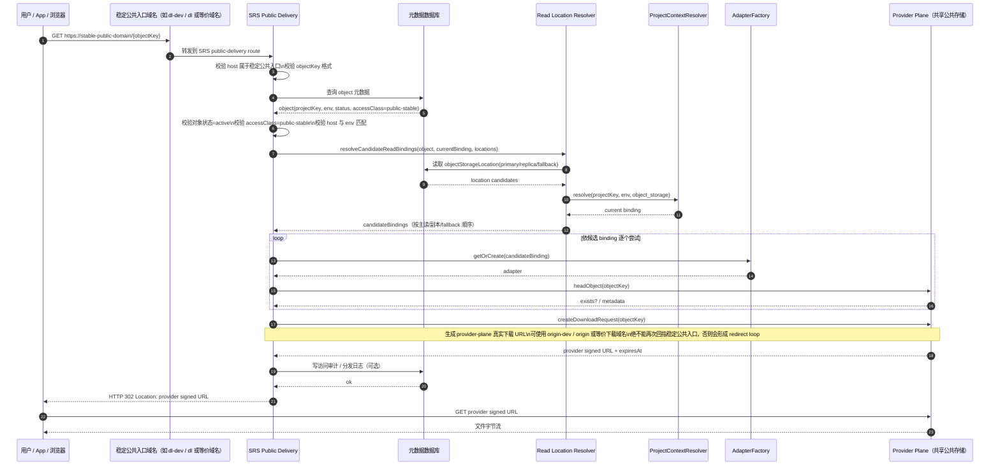

# SRS 理想状态：私有对象与公共对象上传/下载时序图

> 仅描述理想状态。  
> 私有对象 = `private-signed` / `internal-signed`；公共对象 = `public-stable`。  
> 业务项目统一只调用 SRS API；底层 provider / bucket / CDN 细节对业务侧透明。
>
> ## 域名使用原则（理想状态）
> - **公共对象下载**：必须通过稳定公共入口域名（例如 `dl-dev` / `dl` 或等价域名）对外暴露，保证用户侧链接合同稳定。
> - **私有/内部对象下载**：不使用稳定公共入口域名；默认返回签名下载 URL。可按 provider plane 需要配置下载域名（例如 `origin-dev` / `origin` 或等价域名），但这属于底层实现选择，不属于用户侧稳定公共合同。
> - **所有对象上传**：都不要求通过稳定公共入口域名；业务方统一通过 SRS 申请上传签名后，直传到底层 provider。
> - **核心分层**：`dl-dev` / `dl` 代表 delivery plane；`origin-dev` / `origin` 或 provider 默认 host 代表 provider plane；两层职责必须分离，避免 redirect loop 与合同漂移。

## 术语说明

- **delivery plane**：面向用户或外部调用方的稳定分发入口层。典型表现为 `dl-dev` / `dl` 这类长期稳定域名。它负责稳定链接合同，不直接等同于底层存储桶。
- **provider plane**：真实对象存储访问层。它负责上传签名、下载签名、对象存在性检查、删除等实际存储动作；可表现为 provider 默认 host，或 `origin-dev` / `origin` 这类下载域名。
- **public-stable**：公共稳定访问级别。适用于 APK、桌面安装包、未来公共媒体等需要长期稳定外链的对象。下载时必须通过稳定公共入口合同暴露。
- **private-signed**：私有签名访问级别。适用于头像、附件、私有文档等对象。下载时通过受控 API 申请临时签名 URL，不对外暴露稳定公共入口。
- **internal-signed**：内部签名访问级别。适用于日志、归档、审计产物等内部对象。下载方式与私有对象类似，但权限边界更严格。
- **binding**：`projectKey + runtimeEnv + serviceType` 对应的一条项目服务绑定记录。它决定当前请求实际使用哪个 provider、bucket、region、凭证与下载域名，是运行时真相源。
- **objectKey**：对象在逻辑层的统一键，例如 `{project}/{env}/{domain}/{scope}/{entityId}/{fileKind}/{yyyy}/{mm}/{uuid}-{filename}`。项目隔离、环境隔离、对象语义和迁移能力都围绕它展开。
- **objectProfile**：对象的业务画像，例如 `release_artifact`、`private_media`、`internal_archive`。它帮助策略层推导访问方式和交付方式。
- **accessClass**：对象访问级别，例如 `public-stable`、`private-signed`、`internal-signed`。它决定对象最终是走稳定公共入口还是签名下载。

## 1. 私有对象上传（理想状态）

## 2. 私有对象下载（理想状态）

## 3. 公共对象上传（理想状态）

## 4. 公共对象下载（理想状态）

